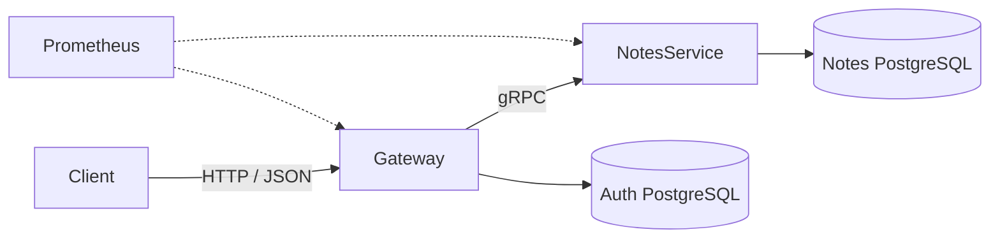

## Notes Service

A backend application for user authentication and note management, built with Go, gRPC, PostgreSQL, and Docker.

The project consists of an HTTP Gateway and a separate NotesService communicating over gRPC.

## Features

- User registration and authentication
- JWT access tokens
- Opaque refresh tokens stored in HttpOnly cookies
- Refresh-token rotation for persistent sessions
- Create, read, update, delete, and list notes
- Cursor-based pagination
- Soft deletion
- Rate limiting
- Request ID propagation between HTTP and gRPC services
- Structured logging
- Prometheus metrics
- OpenAPI documentation with Swagger UI
- Unit, integration, and end-to-end tests
- Docker Compose environment
- Database migrations

## Architecture



## Technology Stack

- Go
- gRPC and Protocol Buffers
- PostgreSQL
- Docker and Docker Compose
- OpenAPI / Swagger UI
- Prometheus

## Launch


Create a local JWT secret file from the provided example:

```bash
cp secrets/jwt_secret.example secrets/jwt_secret
```

Replace its contents with a secret containing at least 32 bytes.

Start the application:

```bash
docker compose up --build
```

## API Documentation

The complete HTTP API contract, including endpoints, request bodies, responses, and authentication requirements, is available through Swagger UI:

```text
http://localhost:5682
```

The public HTTP API is exposed by the Gateway. Note operations are forwarded to NotesService over gRPC.

## Metrics

The metrics are awailable through Prometheus UI:

```text
http://localhost:9090
```

## Authentication

The Gateway returns short-lived JWT access tokens in JSON responses.

Random refresh tokens stored in HttpOnly cookies and validated against the database. Persistent sessions use refresh-token rotation when the existing token approaches expiration.

Protected endpoints require:

```http
Authorization: Bearer <access-token>
```

## Tests

Run all Go tests:

```bash
make test-all
```


